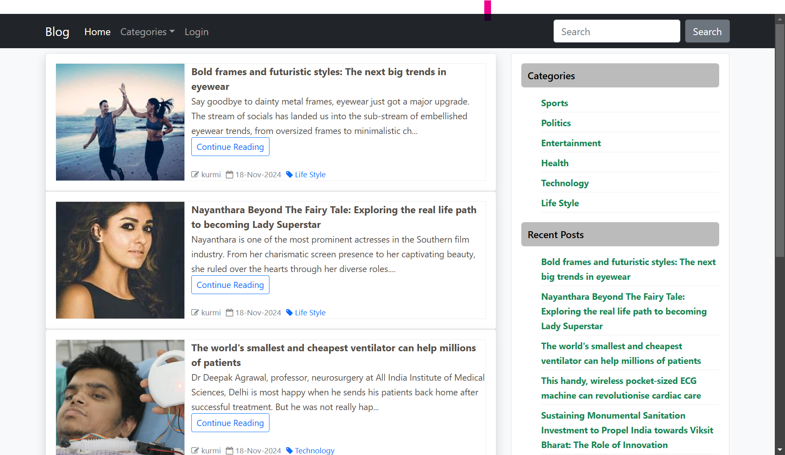
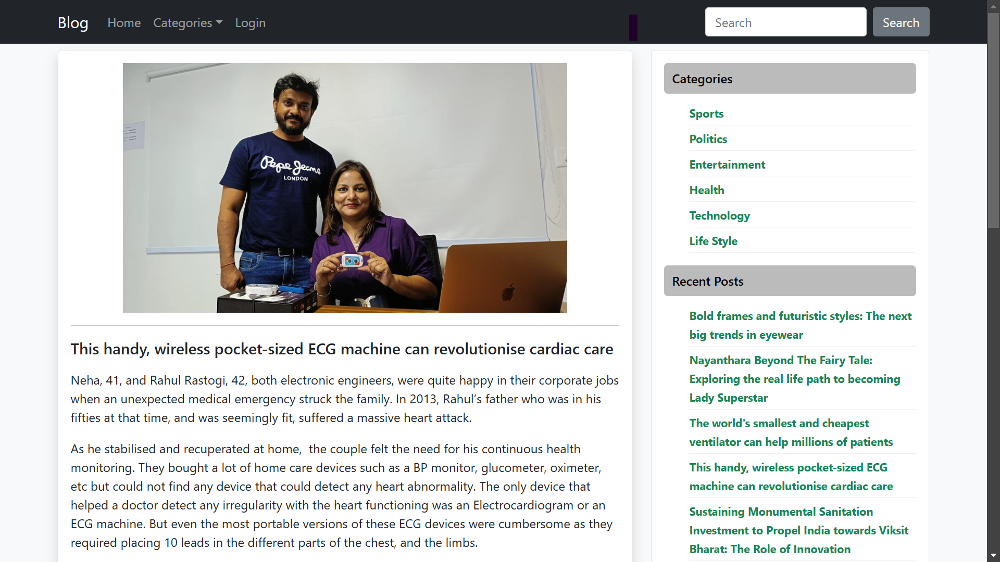
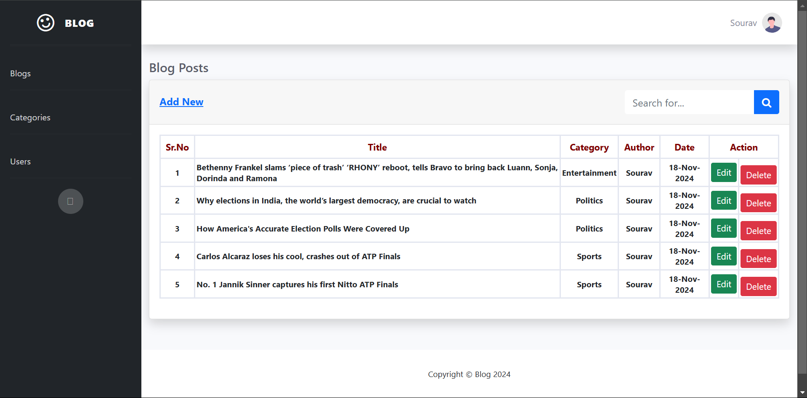
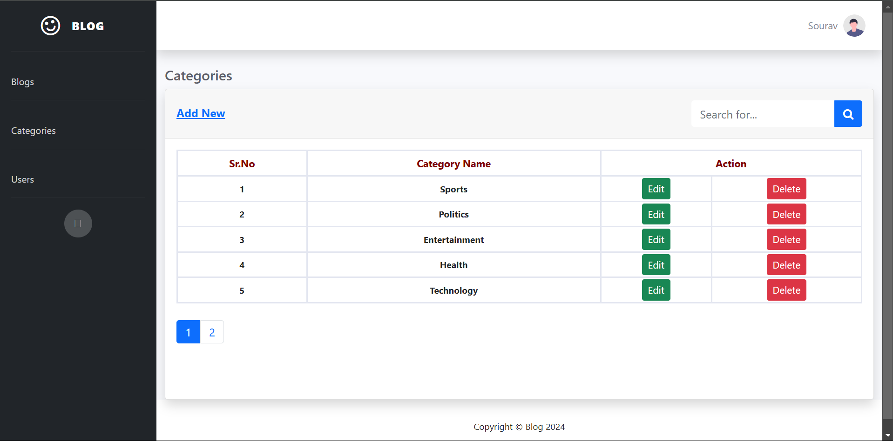
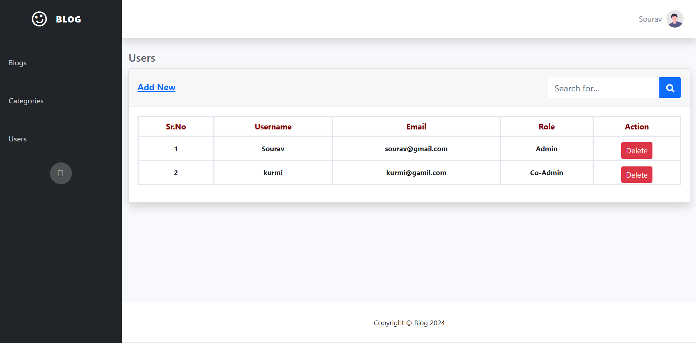
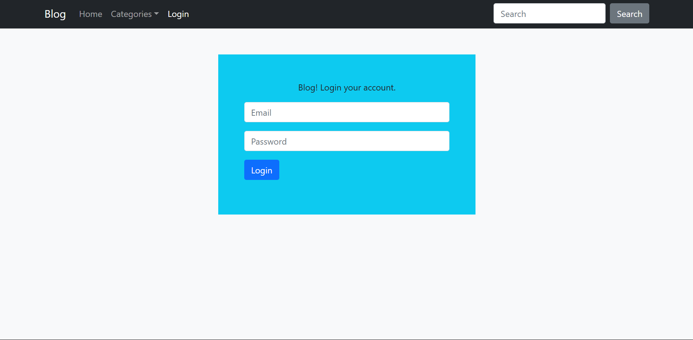

# Blog App in PHP

A simple blog application built using PHP, MySQL, and basic front-end technologies. This project allows users to create, view, and manage blog posts, along with user authentication for admins. It includes features such as CRUD operations for posts, comment management, and more.

## Features

- **User Authentication**: Admin users can log in to manage posts and comments.
- **CRUD Operations**: Create, read, update, and delete blog posts.
- **Comments**: Users can comment on blog posts.
- **Responsive UI**: The app is designed with a simple, responsive layout.
- **Post Categories**: Users can categorize posts for easier navigation.

## Tech Stack

- **Backend**: PHP
- **Frontend**: HTML, CSS, JavaScript
- **Database**: MySQL
- **Authentication**: Sessions

## Screenshots

### 1. Home Page

The landing page of the blog app where users can see a list of all posts.

### 2. Post Page

View individual blog posts along with comments from other users.

### 3. Admin Dashboard

An admin panel for managing blog, only accessible by logged-in admins.

An admin panel for managing categories, only accessible by logged-in admins.
An admin panel for managing users, only accessible by logged-in admins.

### 4. Login Page

Login page for admins to access the dashboard.

---

